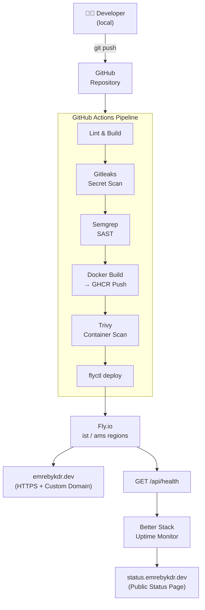

# Emre Büyükdere – Portfolio

Personal developer portfolio built with **Astro**, **Tailwind CSS**, and deployed on **Fly.io** with a full DevSecOps pipeline.

## Architecture



## Stack

| Layer | Technology |
|---|---|
| Framework | [Astro 5](https://astro.build) – SSR mode |
| Styling | [Tailwind CSS 3](https://tailwindcss.com) |
| Runtime | Node.js 20 (Alpine) |
| Container | Docker multi-stage build |
| Registry | GitHub Container Registry (GHCR) |
| CI/CD | GitHub Actions |
| Deployment | [Fly.io](https://fly.io) |
| Email | [Resend](https://resend.com) |
| Monitoring | [Better Stack](https://betterstack.com) |
| Logging | Pino (structured JSON) |

## Features

- **7 sections**: Hero, Projects, Skills, Experience, Hobbies, Contact, Footer
- **Dark Mode** – Tailwind `dark:` classes, persisted in localStorage
- **i18n** – Turkish (default) + English via `/en/` path
- **Contact Form** – Resend API integration
- **`/api/health`** – SRE health check endpoint
- **OG / Twitter Card** meta tags
- **DevSecOps**: Gitleaks + Semgrep + Trivy in CI pipeline
- **Multi-region**: Fly.io `ist` (Istanbul) + `ams` (Amsterdam)

## Local Development

```bash
# Install dependencies
npm install

# Start dev server
npm run dev

# Build for production
npm run build
```

## Docker

```bash
# Build and run locally
docker compose up --build

# Health check
curl http://localhost:3000/api/health
```

## Deployment

Deployed automatically via GitHub Actions on push to `master`.

Manual deploy:
```bash
fly deploy
```

Multi-region:
```bash
fly regions add ams
```

## Environment Variables

| Variable | Description |
|---|---|
| `RESEND_API_KEY` | Resend email API key |
| `LOG_LEVEL` | Pino log level (default: `info`) |

## AI Declaration

This project was built with the assistance of Claude (Anthropic). AI was used to:
- Generate boilerplate Astro component structure
- Draft Tailwind CSS utility class compositions
- Create the GitHub Actions workflow template

All content (project descriptions, personal information, tech choices) was provided and verified by the developer.
